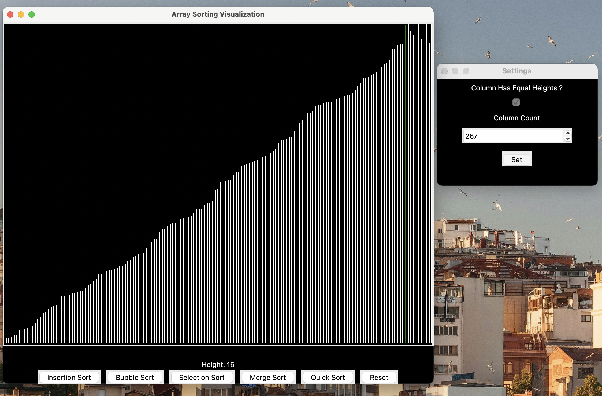

# 🚀 Array Sorting Visualization

Welcome to the **Array Sorting Visualization** project! This tool, built with Python and Tkinter, helps you visualize various array sorting algorithms. It's perfect for learning and understanding how different sorting methods work.

## 🌟 Features

- 📊 Visualizes sorting algorithms:
  - Insertion Sort
  - Bubble Sort
  - Selection Sort
  - Merge Sort
  - Quick Sort
- 🛠️ Customize column heights
- ⏱️ Measures and displays sorting time
- 🖱️ Interactive UI with real-time column height display on mouse hover

## 📚 Getting Started

Follow these instructions to get a copy of the project running on your local machine.

### Prerequisites

Make sure you have Python installed. You can download it from [python.org](https://www.python.org/).

### Installation

1. **Clone the repository:**
    ```bash
    git clone https://github.com/your-username/array-sorting-visualization.git
    cd array-sorting-visualization
    ```

2. **Install the required dependencies:**
    ```bash
    pip install pygame
    ```

### Usage

Run the `main.py` file to start the application:
```bash
python main.py
```

## 🖼️ Screenshot



## 📜 License

This project is licensed under the MIT License.

## 🙋‍♂️ Author

- [LeatherFire](https://github.com/LeatherFire)

---
